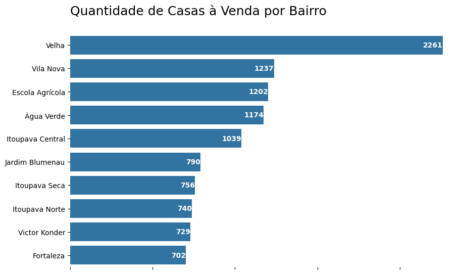

# Projeto Imobiliária

## Análise de dados
A análise de dados é o processo de aplicação de técnicas estatísticas e lógicas para avaliar alguns tipos de informações.

Esse processo compreende a inspeção, investigação, armazenamento e acompanhamento de informações em formato de dados para obter novos conhecimentos.
(fonte: https://www.alura.com.br/empresas/artigos/analise-de-dados?srsltid=AfmBOopFcL2TKIZgjWaXpkeOfYpQ4IiuXyUfqz2ar19BoArlyf7iyIk2.)

## Processo
### Importando as bibliotecas e limpando os dados

As bibliotecas que utilizei nesse projeto foram:
**Pandas**, **Seaborn**, **Matplotlib**. 

Primeira etapa a ser realizada é pegar o arquivo.csv e gerar um df com as informações.

A proxima é formalizar perguntas que poderiam ser respondidas e formalizei as seguintes perguntas:

Quais bairros tem mais casas a venda?, Qual casa mais cara?, Qual a maior casa?, Qual bairro tem as casas mais caras?, Preço por mtr² por bairro?

Com essas perguntas comecei a desenvolver alguns códigos e graficos para poder respondelos.

Respondendo todas as perguntas que foram criadas e gerando todos os graficos, seria interessante colocar essas informações em um Dashboard e tambem criar um modelo de aprendizado maquina para gerar automaticamente o valor de um imovel de acordo com as caracteristicas informadas.
