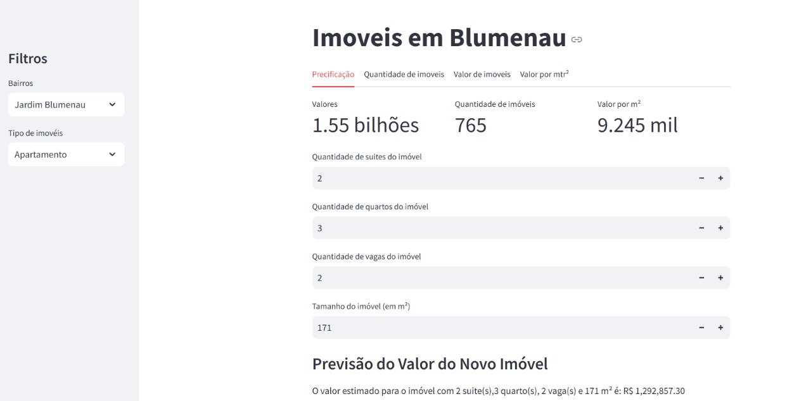

# Projeto Imobiliária

## Dashboard
Um dashboard, também conhecido como painel de controle, é uma interface gráfica que exibe informações, indicadores, e métricas de desempenho de forma visual e interativa.
(fonte: https://ebaconline.com.br/blog/o-que-e-um-dashboard-e-como-fazer-um.)

## Processo
### Importando as bibliotecas

As bibliotecas que utilizei nesse projeto foram:
**Pandas**, **Numpy**, **Seaborn**, **Matplotlib**, **Streamlit**, **Millify**, **Sklearn**, **Statsmodel**. 

Primeira etapa a ser realizada é pegar o arquivo.csv e gerar um df com as informações.

### Etapas

Primeira etapa a ser realizada é pegar o arquivo.csv e gerar um df com as informações.

Após isso com os dados devidamente carregados, gerei uma variavel com os nomes dos bairros e tambem com o tipo de imovel.
Isso será relevante para gerar um filtro no dashboard.

Configurados os filtros, comecei a pegar todas as informações que foram realizadas nos processos de analise de dados e tambem de precificação dos imoveis.

simplismente copiei e colei as informações, mas sempre mantendo uma estrutura coerente das informações para que eu não me perdesse.

Gerado todos os gráficos, variaveis e modelo de precificação, trabalhei na estrutura do dashboard, como colunas onde iriam ficar as métricas, containers para colocar os gráficos e tambem o modelo de precificação.

### Dashboard

O Dashboard ficou simples mas trouxe todas as informações que eu desejava, também todos os graficos que achei relevante na etapa de análise de dados.

### Upload do Dashboard e upload do projeto no Github

Para finalizar todo o projeto da imobiliaria, precisava deixar esse dashboard em algum lugar onde qualquer pessoa interessada podesse ver e testar. O melhor lugar é o proprio site da Streamlit e foi lá onde postei o Dashboard.

Tambem para finalizar coloquei todo o projeto que desenvolvi em um repositório online para que qualquer um podesse ver, analisar, testar e quem sabe copiar. E esse repositório foi o Guithub.

Link Github: https://github.com/Rafinhatome/Projeto-Imobiliaria
Link Streamlit: https://dashboard-imob.streamlit.app/
