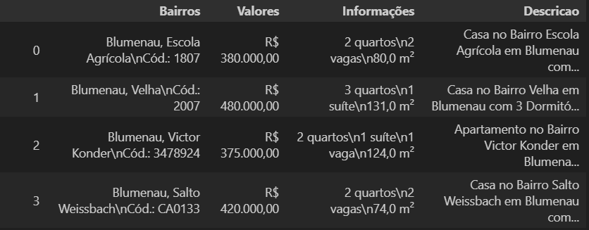
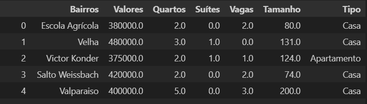

# Projeto Imobiliária

## Limpeza de dados
Limpeza de dados, também conhecida como depuração de dados, identifica e corrige erros, duplicações e informações irrelevantes em um conjunto de dados brutos. Como parte do processo de preparação, a limpeza de dados oferece dados precisos e adequados que geram visualizações, modelos e decisões de negócio confiáveis.
(fonte: https://www.alteryx.com/pt-br/glossary/data-cleansing#:~:text=Limpeza%20de%20dados%2C%20tamb%C3%A9m%20conhecida,e%20decis%C3%B5es%20de%20neg%C3%B3cio%20confi%C3%A1veis.)

## Processo
### Importando as bibliotecas e limpando os dados

As bibliotecas que utilizei nesse projeto foram:
**Pandas**, **Numpy**. 

Primeira etapa a ser realizada é pegar o arquivo.csv e gerar um df com as informações.
Após a leitura dos dados, eles estavam da seguinte maneira:

Na coluna "Bairros", preciso pegar o nome correto do bairro, vou usar a primeira linha como exemplo: **Blumenau, Escola Agrícola\nCód.: 1807**, é necessario pegar somente a informação **Escola Agrícola**.

"Valores" preciso somente da informação **380000**.

Já na coluna "Informação", é um pouco mais complicado, por que preciso das seguintas informações: Suite, Quartos, Vagas, tamnho.

Assim como na coluna "Descrição", preciso da informação se é Casa ou Apartamento.

Outra etapa que foi realizada é retirar os imoveis que não possuem os valores necessarios, como "Tamanho", "Bairro", "Valor" e tambem imoveis que possuem "Tamanho" inferior a 50mtr².

Sobre imoveis duplicados, eu os mantive, por que no momento não era possivel saber quais estão duplicados e quais não estão.

Após realizar todo o processo, o df ficaou da seguinte maneira:

## Exportando os dados para um arquivo CSV

Com os dados limpos e organizados, exportei eles como csv novamente para avançar no próxima etapa que é analisar e gerar um sistema de precificação.
