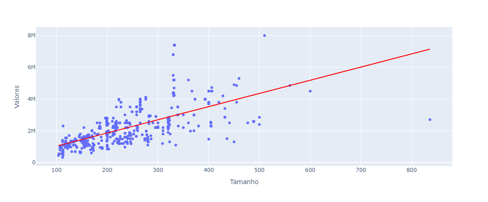

# Projeto Imobiliária

## Precificação de imoveis com Machine Learning (Regressão Linear)
O machine learning (ML) é o subconjunto da inteligência artificial (IA) que se concentra na construção de sistemas que aprendem, ou melhoram o desempenho, com base nos dados que consomem.
(fonte: https://www.oracle.com/br/artificial-intelligence/machine-learning/what-is-machine-learning/.)

## Processo
### Importando as bibliotecas e limpando os dados

As bibliotecas que utilizei nesse projeto foram:
**Pandas**, **Seaborn**, **Matplotlib**, **Plotly**, **Sklearn**, **Statsmodel**. 

Primeira etapa a ser realizada é pegar o arquivo.csv e gerar um df com as informações.

O proximo passo e verificar se existe uma corelação entre as caracteristicas do imovel.

Também gerei um grafico Pairplot para entender melhor as informações e pude perceber que esxiste uma relação muito forte entre o valor do imóvel e o tamanho do imovel.

A proxima etapa foi realizar um Split dos dados e separa-los em treino e teste. Utilizei 30% dos dados para teste.

Relizei o treino do modelo, tambem verifiquei distribuição dos residuos e o R² do modelo.

O modelo ficou interessante e realizei alguns testes, para verificar se estava funcionando perfeitamente ou próximo do que desejava.
O modelo de precificação estava interessande e gerando valores que estavam aproximadamente do correto. Comparei os valores com o site onde extrai os dados.

Para finalizar o projeto, agora era incluir esse modelo a um Dashboard.