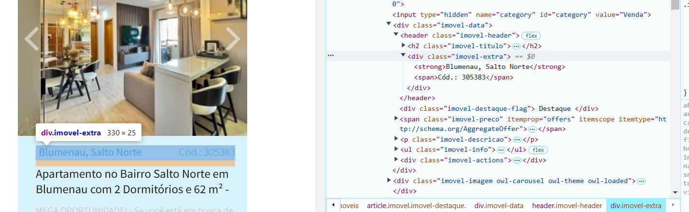

# Projeto Imobiliária

## Web Scraping
O Web scraping, ou “raspagem de dados”, é uma ferramenta muito utilizada em estratégias de transformação digital e também para automatizar processos de coleta e consulta de dados e informações públicas, para diversos fins.
(fonte: https://netrin.com.br/apis/web-scraping-o-que-e-como-funciona/#:~:text=O%20Web%20scraping%2C%20ou%20%E2%80%9Craspagem,informa%C3%A7%C3%B5es%20p%C3%BAblicas%2C%20para%20diversos%20fins. )

## Processo
### Importando as bibliotecas e extraindo os dados

As bibliotecas que utilizei nesse projeto foram:
**Pandas**, **Selenium** e **Time**

A primeira etapa foi entrar no site que escolhi e inspecionando aonde estavam as informações necessarias.

Analisando o site, decidi raspar as seguintes informações:
**Bairros**, **Valores**, **infos** e **Descrições**.
Escolhi essas informações por que nelas continham todos os dados que seriam relevantes para mim, como: Valor, Tamanho, Quartos, Suítes, Vagas e se era casa ou apartamento.

O formado que eu recebia dos dados estavam da seguinte maneira:
**"Blumenau, Escola Agrícola
Cód.: 1807";R$ 380.000,00;"2 quartos
2 vagas
80,0 m²";Casa no Bairro Escola Agrícola em Blumenau com 2 Dormitórios e 80 m² - 1807**

Após configurar o site e as informações que iria trazer, tambem configurei o **Selenium** para que quando se passase alguns segundos, era para clicar automaticamente no botão de avançar a página e assim sucessivamente.
Com isso foi capaz de acessar cerca de 1300 paginas e 20 mil imoveis na cidade de Blumenau/SC

## Exportando os dados para um arquivo CSV

Assim, passado 2 horas extraindo os dados de 20 imoveis, coloquei essas infomações em um dataframe e exportei em um arquivo .csv para depois realizar a limpeza dos dados, analisar e gerar um sistema de precificação.
